# PoliticianFinder 개발 업무 구조 다이어그램

**작성일**: 2025-10-30
**총 업무 수**: 144개 (7 Phases)
**기준**: 의존성·병렬성·인접성 고려한 기술적 배치

---

## 1. 전체 단계(Phase) 흐름도

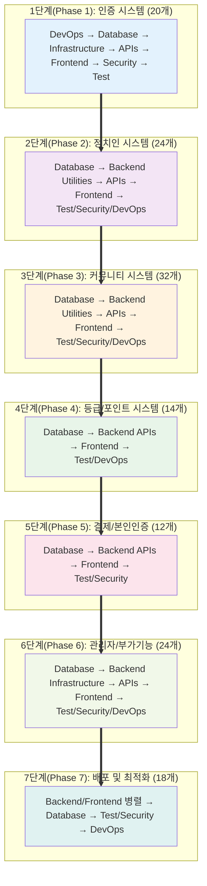

---

## 2. 개발 영역(Area) 아키텍처

```mermaid
graph TD
    A[DevOps 영역<br/>프로젝트 초기화, CI/CD, 스케줄러] --> B[Database 영역<br/>스키마, 마이그레이션, 트리거, 타입]
    B --> C[Backend Infrastructure 영역<br/>클라이언트, 미들웨어, 보안 설정]
    C --> D[Backend APIs 영역<br/>비즈니스 로직, REST APIs]
    D --> E[Frontend 영역<br/>UI, UX, 페이지, 컴포넌트]
    E --> F[Security (별도 영역 아님)<br/>각 영역에 통합됨: 보안 설정, 검증, 암호화]
    F --> G[Test 영역<br/>E2E, API 테스트, 부하 테스트]

    style A fill:#ffebee
    style B fill:#e3f2fd
    style C fill:#f3e5f5
    style D fill:#fff3e0
    style E fill:#e8f5e9
    style F fill:#fce4ec
    style G fill:#f1f8e9
```

---

## 3. 1단계(Phase 1) 상세 의존성 다이어그램 (20개)

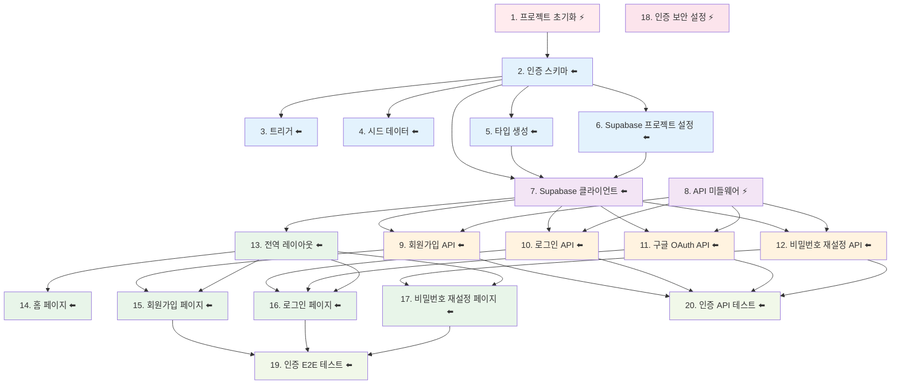

---

## 4. Phase별 작업 분류 및 통계

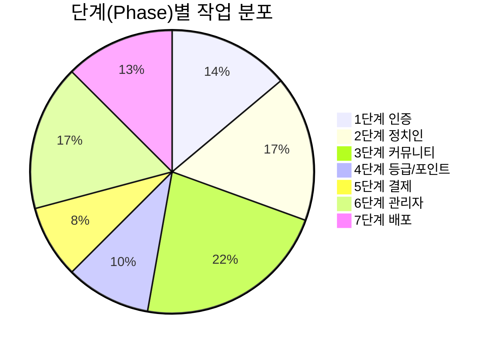

---

## 5. 개발 영역(Area)별 작업 분포 (전체 144개)

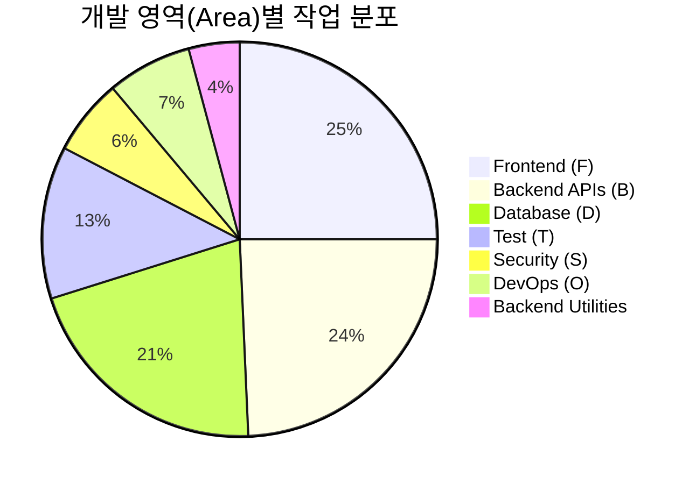

---

## 6. 2-7단계(Phase 2-7) 간략 구조

### 2단계(Phase 2): 정치인 시스템 (24개)

```mermaid
graph LR
    subgraph Database[Database: 7개]
        D1[정치인 스키마]
        D2[관심 정치인]
        D3[AI 평가]
        D4[트리거]
    end

    subgraph Backend[Backend: 10개]
        B1[정치인 API]
        B2[AI 평가 연동]
        B3[크롤링 스크립트]
        B4[데이터 유틸]
    end

    subgraph Frontend[Frontend: 3개]
        F1[정치인 목록]
        F2[정치인 상세]
        F3[관심 정치인]
    end

    subgraph Others[Test/Security/DevOps: 4개]
        O1[E2E 테스트]
        O2[API 테스트]
        O3[보안 설정]
        O4[크롤링 스케줄러]
    end

    Database --> Backend
    Backend --> Frontend
    Frontend --> Others
```

### 3단계(Phase 3): 커뮤니티 시스템 (32개)

```mermaid
graph LR
    subgraph Database[Database: 8개]
        D1[게시글 스키마]
        D2[댓글 스키마]
        D3[공감/공유]
        D4[팔로우]
        D5[알림]
        D6[트리거]
    end

    subgraph Backend[Backend: 12개]
        B1[게시글 API]
        B2[댓글 API]
        B3[공감/공유 API]
        B4[팔로우 API]
        B5[알림 API]
        B6[유틸리티]
    end

    subgraph Frontend[Frontend: 6개]
        F1[커뮤니티 메인]
        F2[게시글 상세 2종]
        F3[글쓰기 2종]
        F4[알림 페이지]
    end

    subgraph Others[Test/Security/DevOps: 6개]
        O1[E2E 테스트]
        O2[API 테스트 3종]
        O3[보안]
        O4[스케줄러]
    end

    Database --> Backend
    Backend --> Frontend
    Frontend --> Others
```

### 4단계(Phase 4): 등급/포인트 시스템 (14개)

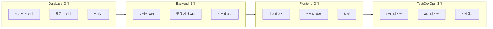

### 5단계(Phase 5): 결제/본인인증 (12개)

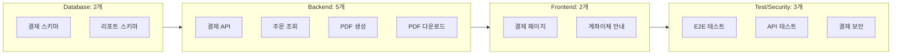

### 6단계(Phase 6): 관리자/부가기능 (24개)

```mermaid
graph LR
    subgraph Database[Database: 3개]
        D1[관리자 스키마]
        D2[검색 최적화]
        D3[타입 업데이트]
    end

    subgraph Backend[Backend: 9개]
        B1[관리자 API 5종]
        B2[통합 검색 API]
        B3[약관 페이지]
        B4[관리자 미들웨어]
    end

    subgraph Frontend[Frontend: 7개]
        F1[관리자 대시보드]
        F2[회원 관리]
        F3[정치인 관리]
        F4[신고 관리]
        F5[검색/서비스/고객센터]
    end

    subgraph Others[Test/Security/DevOps: 5개]
        O1[E2E 테스트]
        O2[API 테스트]
        O3[관리자 보안]
        O4[로그 수집]
    end

    Database --> Backend
    Backend --> Frontend
    Frontend --> Others
```

### 7단계(Phase 7): 배포 및 최적화 (18개)

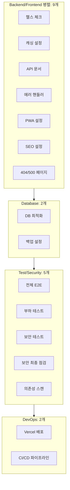

---

## 7. 병렬 처리 가능 작업 (⚡ 표시)

전체 144개 중 **병렬 처리 가능한 작업**: 약 45개

### 병렬 가능 작업 분류:

1. **Phase 1**: Task 1, 8, 18 (3개)
2. **Phase 2**: 대부분의 Database 스키마 (병렬: 7개)
3. **Phase 3**: 대부분의 Database 스키마 (병렬: 7개)
4. **Phase 4-7**: 독립적인 유틸리티, 보안 설정, DevOps 작업 (병렬: 약 28개)

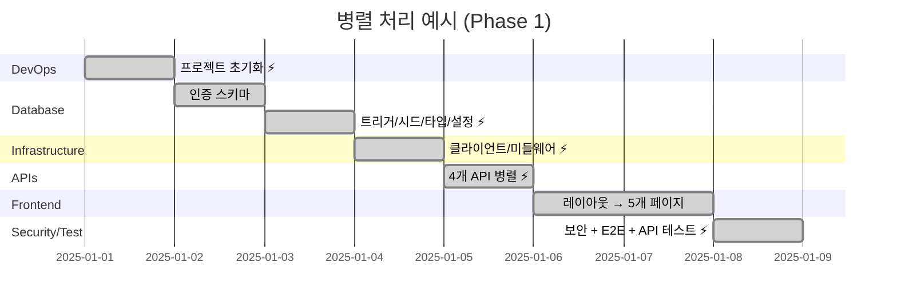

---

## 8. 의존성 체인 요약

### Critical Path (주요 의존성 체인):

```
Phase 1 → Phase 2 → Phase 3 → Phase 4 → Phase 5 → Phase 6 → Phase 7
   ↓         ↓         ↓         ↓         ↓         ↓         ↓
DevOps    Database  Database  Database  Database  Database  Backend/Frontend 병렬
   ↓         ↓         ↓         ↓         ↓         ↓         ↓
Database  Backend   Backend   Backend   Backend   Backend   Database
   ↓         ↓         ↓         ↓         ↓         ↓         ↓
Infra     Frontend  Frontend  Frontend  Frontend  Frontend  Test/Security
   ↓         ↓         ↓         ↓         ↓         ↓         ↓
APIs      Test      Test      Test      Test      Test      DevOps
   ↓
Frontend
   ↓
Test
```

---

## 9. 기술 스택 의존성

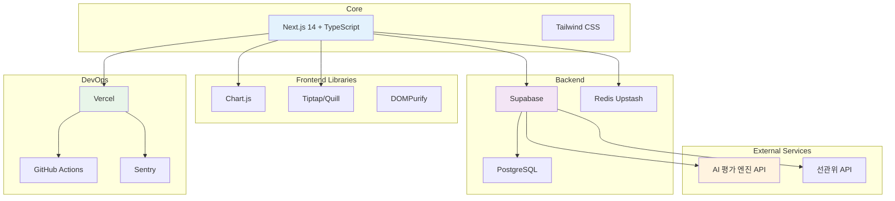

---

## 10. HTML 목업 대조표

**29개 HTML 파일 → 36개 Frontend 생성파일 (+ 108개 Backend/Database/Test/DevOps)**

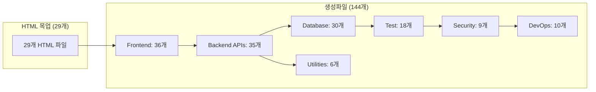

---

## 범례

- **⚡ 병렬 처리 가능**: 다른 작업과 동시에 진행 가능
- **⬅️ 의존성 있음**: 특정 작업 완료 후 진행
- **🔗 그룹**: 연관된 작업들의 묶음
- **(← 번호)**: 의존하는 작업 번호

---

## 개발 영역(Area) 색상 코드

- 🔴 **DevOps 영역**: 프로젝트 기반, CI/CD, 스케줄러
- 🔵 **Database 영역**: 스키마, 마이그레이션, 트리거
- 🟣 **Backend Infrastructure 영역**: 클라이언트, 미들웨어
- 🟠 **Backend APIs 영역**: 비즈니스 로직, REST APIs
- 🟢 **Frontend 영역**: UI, UX, 페이지
- 🟡 **Security** (별도 영역 아님): 각 영역에 통합됨 - 보안 설정, 검증, 암호화
- 🟤 **Test 영역**: E2E, API 테스트, 부하 테스트

---

**생성일**: 2025-10-30
**원본 문서**: `PoliticianFinder_개발업무_최종.md`
**총 144개 생성파일** = 20 (P1) + 24 (P2) + 32 (P3) + 14 (P4) + 12 (P5) + 24 (P6) + 18 (P7)
